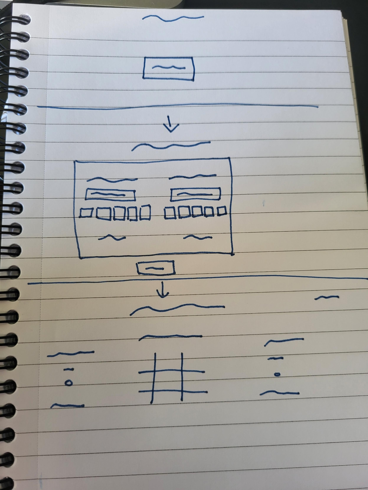

# Tic-Tac-Toe
## Overview
This is my first project. The project assignment was to put into practice what we have learnt in HTML, CSS and JavaScript. 

[Link to the project](https://k-b13.github.io/Tic-Tac-Toe/)

## Technologies Used
* HTML
* CSS
* JavaScript
* Github
* Command-Line

## Timeframe
We were given a week to complete the project and while we were allowed to share thoughts and ideas, but the finished program must be our own. 

## Brief
The brief was to create a Tic-tac-toe game that meets a set technical requirements set out.
The app must
* Render a game board in the browser.
* Switch turns between the different markers.
* Visually display which side won the round.
* Use JavaScript for DOM manipulation.
* Deploy
Outside of the technical requirements we were given free reign to design the game how we liked as well as add any features we believed would improve user experience.

## Main Features
* Name and Icon customisation(choose from 5 options)
* Audio on selection of squares
* Animation on winning squares
* Hover feature on tiles indicating what will happen when clicked


## Planning

I drew a quick sketch of how I wanted the app to work in browser. I wanted a basic start screen which would transition into a customisation screen allowing the player to personalise their player. Once the user was done with the customisation the game board would be loaded with the scoreboards. 
I also wrote out some pseudo code to plan out my approach to achieve the MVP and help focus my efforts.

## Build Process
1. My first step was target the gameboard layout as I wanted a rudimentary layout before I started on the backend so I could see if what I was doing in the backend was working as expected.

I was able to create a simple draft version of my gameboard wireframe using flex and grid.

2. After I had a basic layout and gameboard I moved onto the backend. I added event listeners to all the squares so when they are clicked an icon appears. I also created variables for each player and a variable for the icon that will be placed on the tile. this third variable will alternated between the two player variables.
``` js
const move = (e) => {
  let tile = e.target
    if (tile.innerText === "") {
      tile.innerText = iconToBoard
    } 
```
This code above checks to see if the tile has any text in it and if it doesnt it places whatever is in the iconToBoard variable to the tile. It checks if the tile is blank so the tiles cannot be overwritten if clicked multiple times.
```js
const turn = () => {
  if(turn1){
    iconToBoard = icon2;
    turn1 = false;
  } else {
    iconToBoard = icon1;
    turn1 = true;
    }
}
```
I also added in a function which would make the iconToBoard alternate between the two players icons. I used the turn1 variable as a sort of switch to alternate between the two. It is set to true to begin with so player one goes first.

I then added a message to be displayed at the top of the page which would state whose turn it currently is.
```js
const changePlayer = () => {
  if(!turn1) {
    player = player1.innerText;
  } else {
    player = player2.innerText;
  }
}
const checkTurn = () => {
  message.innerText = `It is ${player}'s turn.`
  changePlayer()
} 
```
The changePlayer would do a similar thing to the icons in that it alternate what is stored in  a tertiary variable in this case called player. The checkTurn function simply displays the message customised based on whose turn it is then calles the changePlayer function.

3. With the grid now having functionality and having alternating turns it was now time to move on to the logic behind the game. I was determined not to resort to an if else statement so spent a long time trying to come up with an alternative. Eventually I came up with an idea of storing every win condition in an array of arrays.
```js
const winArray = [
  ["0", "1", "2"],
  ["0", "4", "8"],
  ["0", "3", "6"],
  ["1", "4", "7"],
  ["2", "5", "8"],
  ["2", "4", "6"],
  ["3", "4", "5"],
  ["6", "7", "8"],
]
```
The numbers are the index of the tiles in an array. I also stored player 1 and player 2's moves in 2 arrays and I will compare these to the win array to see if a player has won.

```js
const endCheck = () => {
  if (playerArray.length > 2) {
    for(let i = 0; i < winArray.length; i++){
          winCombo = winArray[i]
          winArray[i].every(el => {
            check =  playerArray.includes(el)
            return check
            })
            if(check) {
              footerMessage.innerText
               = `${player} has won`
              checkWin = true
              break
            }
        }
      }
  } 
```
The function above first checks the player arrays to see if there are 3 values in it as a player cannot win unless 3 moves have been made. If there are 3 values in the player array it proceeds onto the rest of the code. First it loops through the win combo array and for each loop it checks to see if if that win condition is present within the player moves. If it is then the loop stops and a variable called checkWin is changed to true. This will cause another function to remove all the event listeners from the tiles to stop the game from proceeding and a win message will be displayed.

```js
let tileIndex = tile.getAttribute(["data-index"])
if(!turn1) {
        p1.push(tileIndex)
        p1 = p1.sort()
      } else {
        p2.push(tileIndex)
        p2 = p2.sort()
```

The code above is present with the move function that is triggered when a tile is selected. I have given each tile a data-index which is the same as their index. then depending on if turn1 is true or false it either pushes that tiles index to player 1 array or player 2 array. I also stored the winning combination into a variable so later on I could add animation to them to show how someone won.

I also created a function to check to see if there were 5 items in player 1 array and 4 items in player 2 array and no one had won. The function would then stop the game and declare the game as a draw. I also created a button that would appear when the game was stopped that would reset the board and enable replayability

4. I was able to add some simple sound to the on click listener on the tiles without too much difficulty. As well as adding a scoreboard that would record who had won the previous games.

5. Now that I had the game working I wanted to proceed with the start screen and the customisation screen. I did this by adding and removing a hidden class that sets the display to none. I added some animations to make the transitions between the different screens a bit smoother.

6. After the different screens were done it was time to make the customisation screen functional. 
```js
const iconChange1 = (e) => {
  if (e.target.innerText !== icon2){
    icon1 = e.target.innerText
    displayIcon()
  } else {
    alert("Players cannot have matching icons")
  }
}
```
I created this function for the buttons with each of the 5 icons for player 1 and 2. It checks to see if the button selected matches the other players icon as it would problematic and confusing if both players had the same icon. It then sets icon1 to whatever button is clicked (the function for player 2 will set icon2). The displayIcon() function simply shows the icon selected in the customisation screen as well as on the scoreboard on the game screen.

```js
if (p1Input.value) {
    player1.innerText = p1Input.value;
  }
  if (p2Input.value){
    player2.innerText = p2Input.value;
  }
  p1Input.value = ""
  p2Input.value = ""
```
To change the names I grabbed what was in the input box when confirm is selected then sets what is on the scoreboard to that value. I also cleared the boxes as if the page is later loaded I didn't want anything in the input boxes.

7. I wanted to add a hover feature to indicate what would go in the box if it was clicked. I had some initial difficulty with this as I tried with just a mouseover effect, however this added the icon to the square permenantly also it caused a problem with my initial click code as that checked to see if the tile was empty and now my hover effect was filling in all the tiles.
```js
const hoverEffect = (e) => {
  let tile = e.target
  if(!checkWin){
    if (tile.innerText === "") {
      tile.style.color = "rgba(255, 255, 255, 0.4)";
      tile.innerText = iconToBoard;
    }
  }
}
```
I fixed the permenant effect by adding in a mouseleave event to every square that would remove any text on a tile if its opaque value was 0.4. This prevented the actual moves being scrubbed clean when the mouse was moved off but did get rid of the opaque icons. I used the opaque feature of the rgba rather than the opaque style property as I didn't want the borders to become opaque.
```js
const removeHover = (e) => {
  let tile = e.target
  if (tile.style.color === "rgba(255, 255, 255, 0.4)") {
    tile.innerText = "";
    tile.style.color = "rgba(255, 255, 255, 1)";
  }
}
```
8. I added a start screen option button to the gameboard screen so the player could go back and change the customisation. The button also resets all the variables so its as if the game just started. I also cleaned up some of my code, added in some loops to add event listeners to all the boxes rather than manually giving each tile a effect listener.

## Challenges
I initially had some difficulty with an earlier model of the hover feature. To begin with I was using a 5x5 grid with rows 2 and 4 and columns 2 and 4 being white to create the lines. However, at the time my hover feature would enlarge the square being hovered over and for some squares this was making some of the box not appear. This lead me to explore grid gaps as an alternative and switch to a 3x3 grid. This did cause problems later when I was adding in the background to my project. 

I wanted my grid to be transparent so it looked like it was drawn on the blackboard. Grid gaps caused a problem as their color is set by the element that contained the div so I would have to set the entire grid background to white which means the background was not visible when I made my tiles transparent. I solved this by setting the grid transparent and instead adding partial borders to some of the tiles to create the grid effect. 

This in turn had a knock on effect to how I had to pivot my hover effect which I explain in my build process step 7.

I also had some problems with the win logic as at first the only solution I had was to use an if else statement which I was keen not to use. I spent some time thinking about it and created the array of win conditions and thought I could compare with player choices. After some difficulty I got the idea to give each box data-attribute matching their index and I could just grab the attribute and compare the two. The code required some playing around with and a lot of debugging with console.log but eventually works nicely.

## Wins
I am happy with how the win condition turned out as it works well and is easy to read. Also the way I did it enabled my to save the winning tiles which I was later able to assign animations to.

I am also very happy with how the final hover effect turned out as it required a lot of testing and time to end up at the final product which I am pleased with.

## Takeaways
Write my ReadMe as I am going through each step so it is more coherent.

Spend a bit more time planning and keep records of my plans. Not only for the readme but also to see previous attempts and ideas that didn't work but may have some useful ideas I can use elsewhere.

Sometimes a feature may sound hard to make but if you break it down step by step it makes it a lot less intimidating.

Animation is not as hard as it initially seemed.

Definetly feel more comfortable with JavaScript after being able to explore and create freely.

## Bugs
Currently there are no bugs that I am aware of.

## Future Improvements
* I want to add local storage to the app so I remembers some information like player names, icons selected and score. I came close to having a version working but had a few bugs which need to be looked at when I come back to this project. This version is not currently a part of the app.
* I also want to add a play against computer option when I have more time to work on the computer logic as I didn't want to make a simple computer or one that is impossible to beat.
* Lastly I would add background music with adjustable volume.
